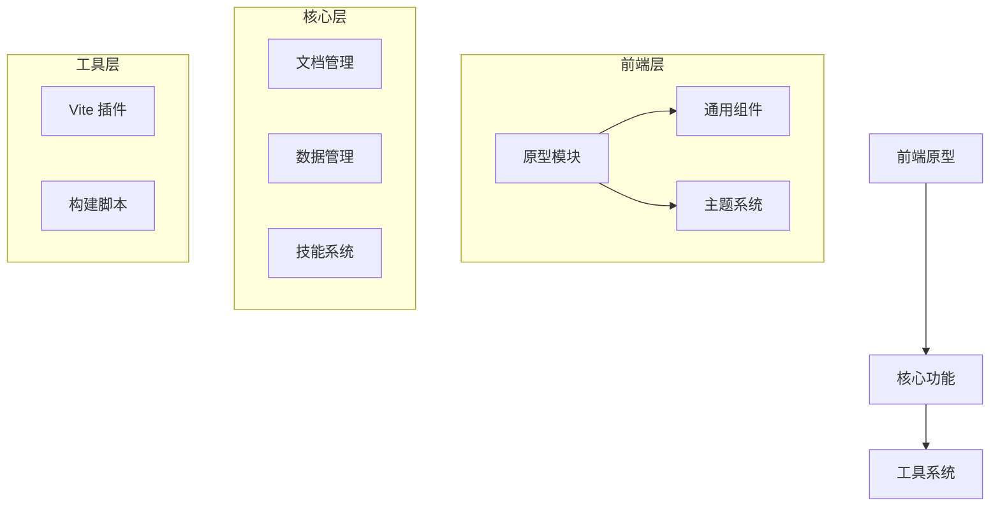

# TrackingPage 项目 Code Wiki

## 1. 项目概述

TrackingPage 是一个基于 Axhub Make 框架的原型与文档协作工作流项目，主要用于铁路旅客服务系统的各类监控页面开发。该项目提供了从需求到文档、原型再到交付的完整工作流，支持生成可运行的交互原型、完整的多类型文档以及可持续复用的资源资产。

### 1.1 核心功能

- **可视化管理原型和文档**：不懂开发的产品和设计师也能直接使用
- **内置专业技能**：30+ 专业的原型生成与文档协作技能
- **项目与资源管理**：让 AI 持续产出视觉风格一致、逻辑统一的原型和文档
- **记忆系统**：通过文档持续沉淀项目记忆，让 AI 越来越懂项目
- **spec 驱动的原型生成**：减少 AI 生成过程中的幻觉和偏题
- **多平台导入导出**：支持从 Axure、V0、Stitch、AIStudio 以及任意网页导入原型或资源，支持导出到 Axure 或 Figma

## 2. 项目架构

### 2.1 整体架构

TrackingPage 采用模块化架构，基于 Vite 构建工具，以 React + TypeScript 为核心技术栈。项目分为前端原型、文档管理、资源管理和插件系统四大模块。



### 2.2 目录结构

| 目录/文件 | 职责 | 说明 |
|---------|------|------|
| `src/prototypes/` | 原型实现 | 包含各类监控页面的原型代码 |
| `src/docs/` | 文档管理 | 存放需求文档、设计规范等 |
| `src/themes/` | 主题系统 | 管理项目的视觉风格 |
| `src/components/` | 通用组件 | 可复用的 UI 组件 |
| `src/database/` | 数据管理 | 模拟数据和配置信息 |
| `vite-plugins/` | Vite 插件 | 项目构建和开发工具 |
| `scripts/` | 构建脚本 | 自动化构建和部署 |
| `skills/` | 技能系统 | AI 辅助生成功能 |

## 3. 主要模块

### 3.1 原型模块 (`src/prototypes/`)

原型模块是项目的核心，包含多个不同功能的监控页面实现。

#### 3.1.1 到发盯控系统 (`arrival-departure-monitoring`)

**功能**：实时监控列车到发状态，包括计划变更、异常告警等。

**主要组件**：
- `TrainTable.tsx`：列车信息表格，展示列车到发时间、状态等
- `FilterBar.tsx`：筛选条件栏，支持按车站、时间等筛选
- `AbnormalAlertPanel.tsx`：异常告警面板，显示异常信息
- `OperationDrawer.tsx`：操作抽屉，提供详细操作功能

**关键文件**：
- [index.tsx](file:///workspace/TrackingPage/src/prototypes/arrival-departure-monitoring/index.tsx)：主入口文件
- [mock-data.ts](file:///workspace/TrackingPage/src/prototypes/arrival-departure-monitoring/mock-data.ts)：模拟数据
- [utils/abnormalDetector.ts](file:///workspace/TrackingPage/src/prototypes/arrival-departure-monitoring/utils/abnormalDetector.ts)：异常检测工具

#### 3.1.2 到发盯控系统 v2 (`arrival-departure-monitoring-v2`)

**功能**：到发盯控系统的升级版，增加了更多功能模块。

**新增组件**：
- `PassengerFlowDrawer.tsx`：客流信息抽屉
- `WaterSewageConfigDrawer.tsx`：给排水配置抽屉
- `TrainFormationDrawer.tsx`：列车编组信息抽屉
- `PlanChangeOverview.tsx`：计划变更概览

**关键文件**：
- [index.tsx](file:///workspace/TrackingPage/src/prototypes/arrival-departure-monitoring-v2/index.tsx)：主入口文件
- [mock-data.ts](file:///workspace/TrackingPage/src/prototypes/arrival-departure-monitoring-v2/mock-data.ts)：模拟数据

#### 3.1.3 代管盯控系统 (`managed-station-monitoring`)

**功能**：监控代管车站的列车运行状态。

**主要组件**：
- `MonitoringPanel/`：监控面板，展示列车信息
- `Timeline/`：时间线组件，展示事件序列
- `TrainConnections/`：列车连接关系展示
- `ConfigWizard/`：配置向导，引导用户完成系统配置

**关键文件**：
- [index.tsx](file:///workspace/TrackingPage/src/prototypes/managed-station-monitoring/index.tsx)：主入口文件
- [hooks/useTrainData.ts](file:///workspace/TrackingPage/src/prototypes/managed-station-monitoring/hooks/useTrainData.ts)：列车数据管理钩子
- [hooks/useConfig.ts](file:///workspace/TrackingPage/src/prototypes/managed-station-monitoring/hooks/useConfig.ts)：配置管理钩子

### 3.2 文档模块 (`src/docs/`)

文档模块用于管理项目的各类文档，包括需求文档、设计规范等。

**主要目录**：
- `requirements/`：需求文档，包含项目的功能需求
- `templates/`：文档模板，用于快速生成标准化文档

**关键文档**：
- [arrival-departure-monitoring-design-spec.md](file:///workspace/TrackingPage/src/docs/arrival-departure-monitoring-design-spec.md)：到发盯控系统设计规范
- [managed-station-monitoring-dev-guide.md](file:///workspace/TrackingPage/src/docs/managed-station-monitoring-dev-guide.md)：代管盯控系统开发指南

### 3.3 主题模块 (`src/themes/`)

主题模块管理项目的视觉风格，确保所有原型和文档的视觉一致性。

**主要主题**：
- `antd-new/`：基于 Ant Design 的现代化主题
- `trae-design/`：Trae 设计系统主题
- `firecrawl/`：Firecrawl 主题

**关键文件**：
- [antd-new/DESIGN-SPEC.md](file:///workspace/TrackingPage/src/themes/antd-new/DESIGN-SPEC.md)：Ant Design 主题设计规范
- [antd-new/designToken.json](file:///workspace/TrackingPage/src/themes/antd-new/designToken.json)：设计令牌配置

### 3.4 组件模块 (`src/components/`)

组件模块提供可复用的 UI 组件，用于构建各类原型。

**主要组件**：
- `ref-button/`：引用按钮组件
- `ref-line-chart/`：引用折线图组件
- `side-menu/`：侧边菜单组件

### 3.5 数据模块 (`src/database/`)

数据模块管理项目的模拟数据和配置信息。

**主要文件**：
- [orders.json](file:///workspace/TrackingPage/src/database/orders.json)：订单数据
- [personnel.json](file:///workspace/TrackingPage/src/database/personnel.json)：人员数据

### 3.6 插件系统 (`vite-plugins/`)

插件系统提供项目的构建和开发工具，基于 Vite 插件架构。

**主要插件**：
- `virtualHtml/`：虚拟 HTML 处理
- `serveAdminPlugin.ts`：管理后台服务
- `docsApiPlugin.ts`：文档 API 服务
- `themesApiPlugin.ts`：主题 API 服务

**关键文件**：
- [virtualHtml/index.ts](file:///workspace/TrackingPage/vite-plugins/virtualHtml/index.ts)：虚拟 HTML 插件入口
- [utils/entriesManifest.ts](file:///workspace/TrackingPage/vite-plugins/utils/entriesManifest.ts)：入口文件管理

## 4. 核心功能

### 4.1 原型生成

项目通过 `spec` 驱动的方式生成原型，确保生成的原型符合需求规范。

**工作流程**：
1. 编写需求文档和规格说明
2. AI 根据规格说明生成原型代码
3. 开发人员进行调整和优化
4. 导出为 Axure/Figma/Html 格式

### 4.2 文档管理

项目提供完整的文档管理功能，支持多种类型的文档生成和管理。

**文档类型**：
- 需求文档：详细描述项目需求
- 用户故事：从用户角度描述功能
- 规格文档：技术实现细节
- 设计规范：视觉设计指南

### 4.3 资源管理

项目管理各类可复用资源，包括主题、组件和数据表。

**资源类型**：
- 主题：视觉风格定义
- 组件：可复用的 UI 组件
- 数据表：模拟数据和配置信息

### 4.4 导入导出

项目支持从多种来源导入原型和资源，也支持导出到多种格式。

**导入来源**：
- Axure
- V0
- Stitch
- AIStudio
- 任意网页

**导出格式**：
- Axure
- Figma
- Html

## 5. 技术栈

| 类别 | 技术/库 | 版本 | 用途 |
|------|---------|------|------|
| 核心框架 | React | ^18.2.0 | 前端 UI 构建 |
| 开发语言 | TypeScript | ^5.9.3 | 类型安全的代码开发 |
| 构建工具 | Vite | ^5.0.0 | 项目构建和开发服务器 |
| CSS 框架 | Tailwind CSS | ^4.2.2 | 实用优先的 CSS 框架 |
| UI 库 | Ant Design | ^6.1.2 | 企业级 UI 组件库 |
| 图表库 | ECharts | ^6.0.0 | 数据可视化图表 |
| 状态管理 | Framer Motion | ^12.38.0 | 动画效果 |
| 工具库 | Dayjs | ^1.11.20 | 日期时间处理 |
| 工具库 | UUID | ^13.0.0 | 唯一标识符生成 |
| 数据处理 | Papaparse | ^5.5.3 | CSV 数据解析 |
| 存储 | Lowdb | ^7.0.1 | 轻量级数据库 |
| 拖拽 | @dnd-kit | ^6.3.1 | 拖拽功能 |

## 6. 关键类与函数

### 6.1 原型相关

#### 6.1.1 到发盯控系统

**TrainTable 组件**
- **功能**：展示列车到发信息的表格组件
- **参数**：
  - `trains`：列车数据数组
  - `onTrainSelect`：列车选择回调函数
- **关键方法**：`renderTrainRow` - 渲染列车行数据

**AbnormalAlertPanel 组件**
- **功能**：展示异常告警信息
- **参数**：
  - `alerts`：告警数据数组
- **关键方法**：`renderAlertItem` - 渲染告警项

**useMultiStation 钩子**
- **功能**：管理多车站数据
- **返回值**：
  - `stations`：车站列表
  - `selectedStation`：当前选中车站
  - `setSelectedStation`：设置选中车站的函数

### 6.2 代管盯控系统

**useTrainData 钩子**
- **功能**：管理列车数据
- **返回值**：
  - `trainData`：列车数据
  - `loading`：加载状态
  - `error`：错误信息

**useConfig 钩子**
- **功能**：管理系统配置
- **返回值**：
  - `config`：配置数据
  - `updateConfig`：更新配置的函数

**MonitoringPanel 组件**
- **功能**：监控面板，展示列车信息
- **参数**：
  - `trainData`：列车数据
  - `config`：配置信息

### 6.3 插件系统

**virtualHtmlPlugin**
- **功能**：处理虚拟 HTML 文件
- **关键方法**：`handleHtmlRequest` - 处理 HTML 请求

**scanProjectEntries**
- **功能**：扫描项目入口文件
- **参数**：
  - `projectRoot`：项目根目录
  - `entryTypes`：入口类型数组
- **返回值**：入口文件清单

**readEntriesManifest**
- **功能**：读取入口文件清单
- **参数**：
  - `projectRoot`：项目根目录
- **返回值**：入口文件清单对象

## 7. 依赖关系

### 7.1 核心依赖

```mermaid
graph LR
    react --> react_dom
    react --> antd
    antd --> @ant-design/icons
    react --> framer_motion
    react --> @dnd-kit/core
    vite --> @vitejs/plugin-react
    vite --> @tailwindcss/vite
    tailwindcss --> vite
```

### 7.2 插件依赖

| 插件 | 依赖 | 用途 |
|------|------|------|
| serveAdminPlugin | vite | 提供管理后台服务 |
| docsApiPlugin | lowdb | 文档数据存储 |
| themesApiPlugin | fs | 主题文件管理 |
| virtualHtmlPlugin | path | HTML 文件路径处理 |

## 8. 项目运行

### 8.1 开发环境

**启动开发服务器**：
```bash
npm run dev
# 或
npm start
```

开发服务器默认运行在 `http://localhost:51720`，支持热更新。

### 8.2 构建项目

**构建命令**：
```bash
npm run build
```

构建产物会生成在 `dist` 目录中。

### 8.3 预览构建结果

**预览命令**：
```bash
npm run preview
```

### 8.4 运行测试

**测试命令**：
```bash
npm test
```

**监视模式测试**：
```bash
npm run test:watch
```

**UI 模式测试**：
```bash
npm run test:ui
```

## 9. 配置与部署

### 9.1 配置文件

**主要配置文件**：
- `vite.config.ts`：Vite 构建配置
- `package.json`：项目依赖和脚本配置
- `.axhub/make/axhub.config.json`：Axhub 配置

### 9.2 部署方式

1. **开发环境**：使用 `npm run dev` 启动开发服务器
2. **生产环境**：
   - 运行 `npm run build` 构建项目
   - 将 `dist` 目录部署到静态文件服务器
   - 配置服务器以支持前端路由

## 10. 开发工作流

### 10.1 原型开发流程

1. **需求分析**：编写需求文档和用户故事
2. **规格设计**：编写技术规格文档
3. **原型生成**：使用 AI 生成初始原型
4. **代码优化**：开发人员调整和优化代码
5. **测试验证**：测试原型功能
6. **导出交付**：导出为 Axure/Figma/Html 格式

### 10.2 文档管理流程

1. **文档创建**：基于模板创建文档
2. **内容编写**：编写文档内容
3. **版本控制**：使用 Git 进行版本控制
4. **协作评审**：团队协作评审文档
5. **持续更新**：根据项目进展更新文档

## 11. 最佳实践

### 11.1 代码规范

- 使用 TypeScript 类型定义
- 遵循 React 最佳实践
- 使用 Tailwind CSS 进行样式管理
- 组件化开发，提高代码复用性

### 11.2 文档规范

- 使用 Markdown 格式编写文档
- 遵循项目模板结构
- 保持文档与代码同步更新
- 详细记录需求变更和设计决策

### 11.3 资源管理

- 统一管理主题和组件
- 使用模拟数据进行开发和测试
- 定期清理和优化资源文件

## 12. 常见问题与解决方案

### 12.1 开发环境问题

**问题**：端口被占用
**解决方案**：Vite 会自动尝试下一个可用端口，或在 `vite.config.ts` 中修改端口配置

**问题**：热更新不生效
**解决方案**：检查网络连接，或重启开发服务器

### 12.2 构建问题

**问题**：构建失败
**解决方案**：检查 TypeScript 类型错误，或查看构建日志

**问题**：构建产物过大
**解决方案**：优化代码，减少不必要的依赖

### 12.3 原型功能问题

**问题**：数据不显示
**解决方案**：检查模拟数据格式，或查看控制台错误信息

**问题**：组件样式异常
**解决方案**：检查 Tailwind CSS 类名，或查看主题配置

## 13. 总结

TrackingPage 项目是一个基于 Axhub Make 框架的原型与文档协作工作流系统，专注于铁路旅客服务系统的监控页面开发。该项目通过 AI 辅助生成、spec 驱动的方式，提供了从需求到文档、原型再到交付的完整工作流。

项目采用模块化架构，包含原型、文档、主题、组件等多个模块，使用 React + TypeScript + Vite + Tailwind CSS + Ant Design 等现代前端技术栈。通过统一的资源管理和文档管理，确保了项目的一致性和可维护性。

TrackingPage 项目不仅是一个技术实现，更是一个完整的工作流程解决方案，为产品、设计师和开发人员提供了高效的协作工具，加速了项目的开发和交付过程。